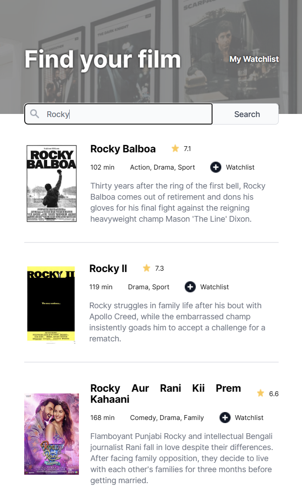

# Movie Watchlist

## Description
This Color Scheme Generator calls the Open Source [Color API](https://www.thecolorapi.com) and fetches a number of related colors, depending of the inputs set by the color control at the left, and the dropdown control in the middle.
 
 

## Technologies
- HTML
- CSS
- JavaScript

## Live link
The app is deployed here:
[https://toms-movie-watchlist.netlify.app](https://toms-movie-watchlist.netlify.app)

Please feel free to visit and try the Color Scheme Generator!
